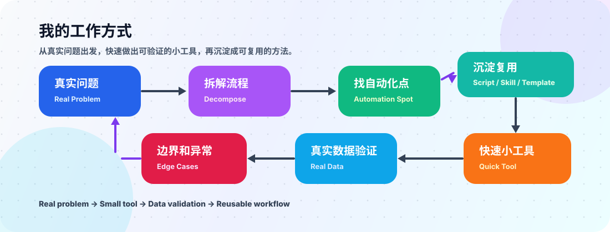
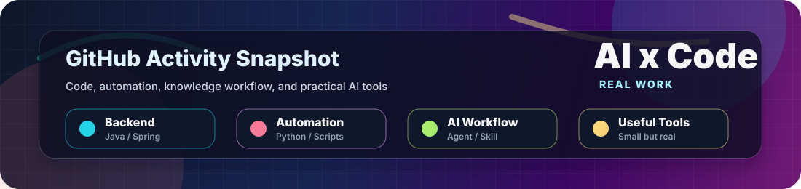

<div align="center">


[](https://git.io/typing-svg)


</div>

---

## 关于我

我是王勇，10 年 Java 后端工程师。现在更关注 **AI 自动化、知识工作流、业务提效工具**。

我喜欢做的不是“看起来很大的平台”，而是能解决具体问题的小系统：把每天重复发生的收集、整理、判断、生成、同步，拆成清晰的流程，再用代码和 AI 工具把它跑起来。

```text
Backend Engineer  ->  Automation Builder  ->  AI Workflow Practitioner
      Java         ->     Python / TS      ->      Agent / Skill / Tool
```

## 我正在折腾什么

| 方向 | 我关心的问题 |
| --- | --- |
| AI 自动化 | 怎么把重复劳动变成稳定流程，而不是一次性 demo |
| 内容工作流 | 怎么让采集、整理、改写、生成、发布更顺手 |
| 知识管理 | 怎么把资料、笔记、聊天记录变成可检索、可复用的资产 |
| 小工具交付 | 怎么用最小成本做出别人真的会用的工具 |
| 后端工程 | 怎么让系统边界、数据流、异常处理更清楚 |

## 能力地图

<div align="center">


</div>

| 工程能力 | 自动化能力 | AI 实践 |
| --- | --- | --- |
| Java / Spring Boot | Python 脚本 | Agent 工作流 |
| 接口设计与系统集成 | 数据采集与清洗 | Prompt / Skill 设计 |
| 数据库与缓存 | 定时任务与监控 | 内容生成与资料整理 |
| 源码阅读与问题定位 | 文件处理与批量生成 | 人机协作流程设计 |

## 我的工作方式

<div align="center">



</div>

## 我适合做的事

- 把手工重复流程改造成半自动化工具
- 给内容生产、资料整理、信息监控做工作流
- 把零散需求拆成能交付的小系统
- 用 Java / Python / TypeScript 串起真实业务流程
- 给 AI 工具补上工程化、可维护、可复用的部分

## 最近关注

```text
AI Agents      ████████████████████░  95%
Automation     ███████████████████░░  90%
Java Backend   ██████████████████░░░  85%
Knowledge Flow █████████████████░░░░  80%
Content Tools  ████████████████░░░░░  75%
```

## GitHub 数据

<div align="center">




</div>

## 一句话

> 我想做的是：用工程能力把 AI 变成真实可用的工具，而不是只停留在聊天窗口里。

<div align="center">


</div>
